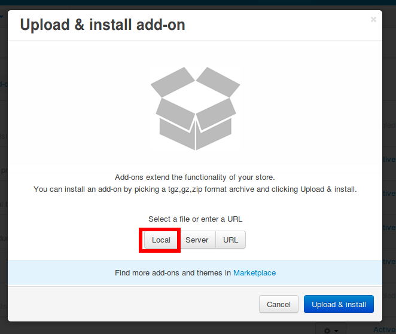
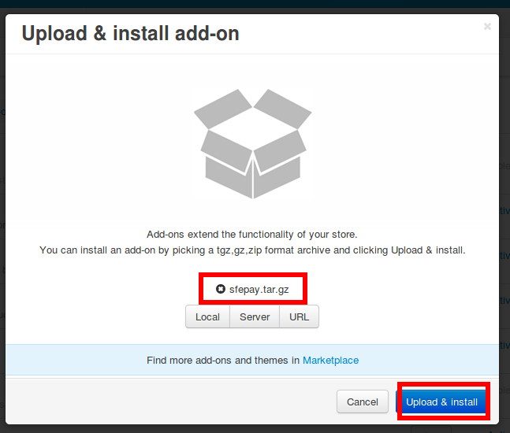
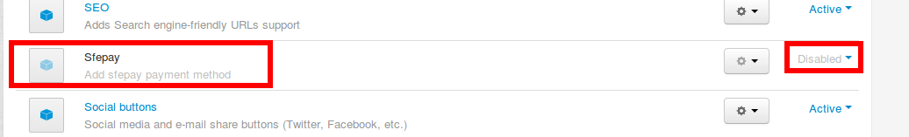
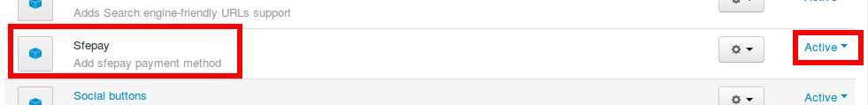
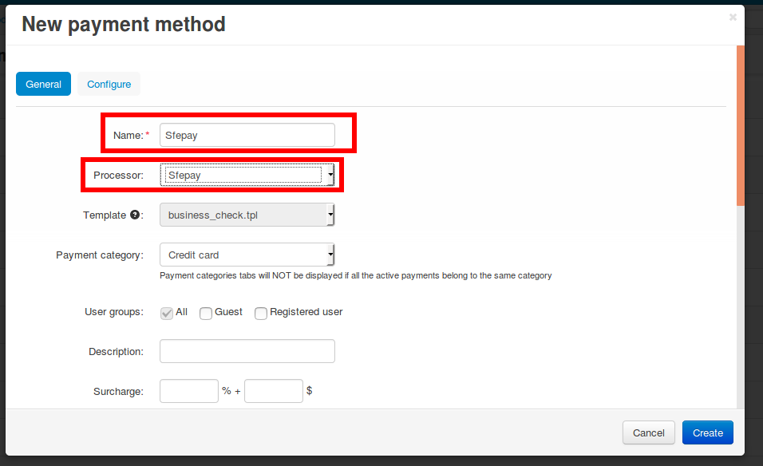
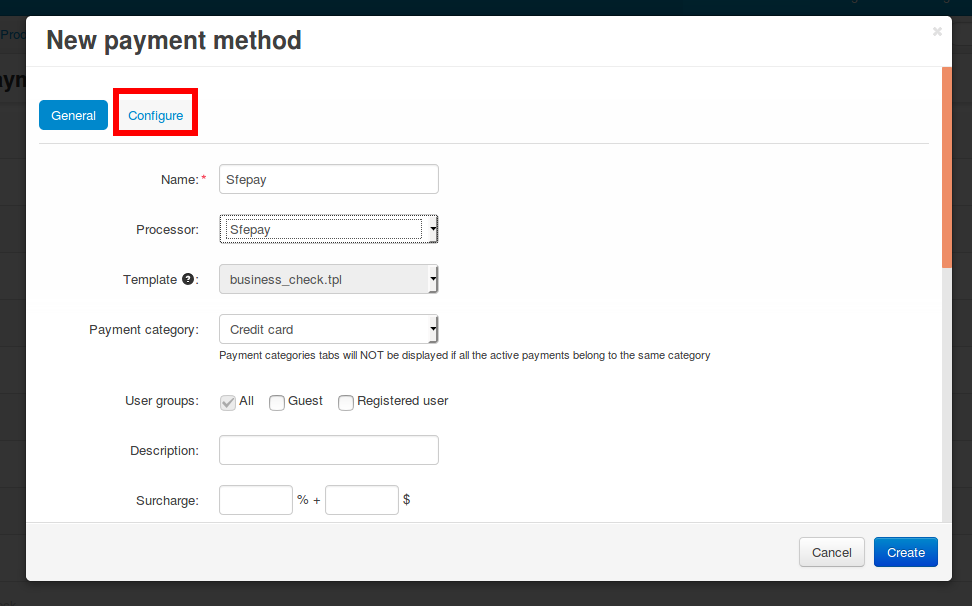
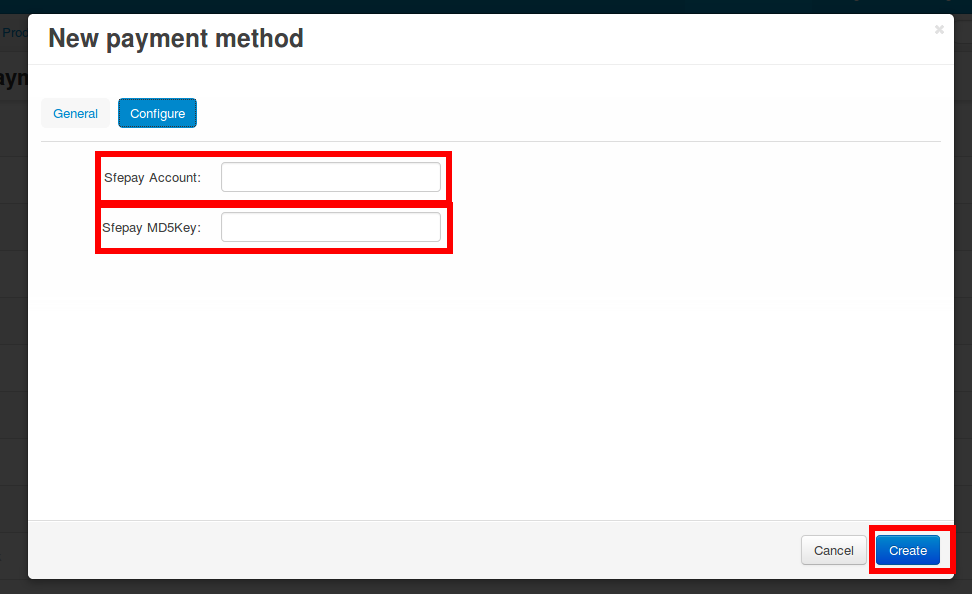
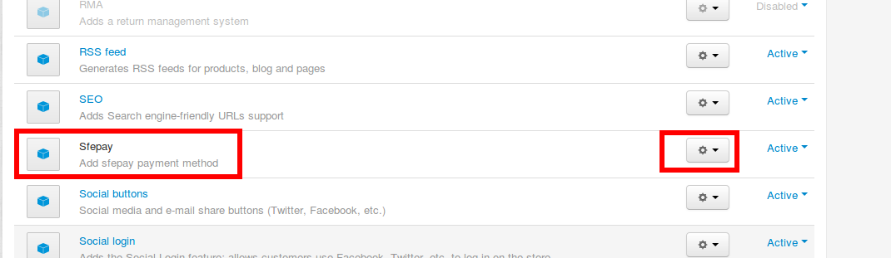
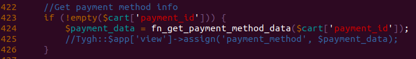

# cscart-payment-sfepay
* Sfepay支付cscart插件使用说明
* 适用与Cs-cart 4.3.2，其他版本并未测试

## 安装方法
* Add-ons -> Manage add-ons -> 点击+

* Local -> 选择sfepay.tar.gz压缩包 -> 点击Upload & Install

* Add-ons -> Manage add-ons -> Installed add-ons -> Sfepay -> 点击Active

## 配置方法
* Administration -> Payment methods -> 点击+

* 按照图中数据填好

* 点击configure选项卡

* 填入商户号和MD5Key，然后点击创建

## 卸载方法
* Add-ons -> Manage add-ons -> Sfepay -> Uninstall

## Trouble Shooting

### 安装后checkout无法显示填写卡号信息等的页面，提示找不到cc_sfepay.tpl文件
* 问题原因
    * 由于sfepay插件使用了自定义模板，安装位置设定于默认目录，如果用户安装了其他主题，则该主题不会包含自定义模板，报错显示找不到该模板文件。
* 解决方案
    * 确认问题
        1. 了解当前使用的网站theme名称
        1. 到`/design/themes/[你使用的theme名称]/templates/views/orders/components/payments`下确认是否有cc_sfepay.tpl文件，如果没有，则证明属于该问题，可以使用下面方法解决。
    * 解决步骤
        1. `cd /design/themes/[你使用的theme名称]/templates/views/orders/components/payments`
        1. `cp /design/themes/responsive/templates/views/orders/components/payments/cc_sfepay.tpl .`
        1. `chown www:www cc_sfepay.tpl`

### 安装后使用该支付方式支付的订单无法编辑
* 问题原因
    * 自定义的支付页面模板与编辑订单模板不兼容导致
* 解决方案
    * 打开/app/controllers/backend/order_management.php文件
    * 在425行首添加//，改成下图所示

